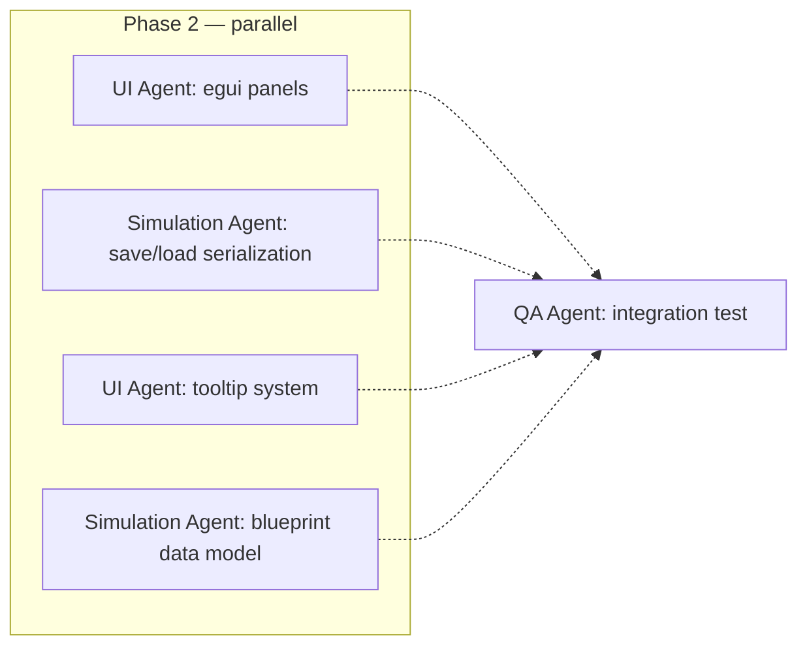
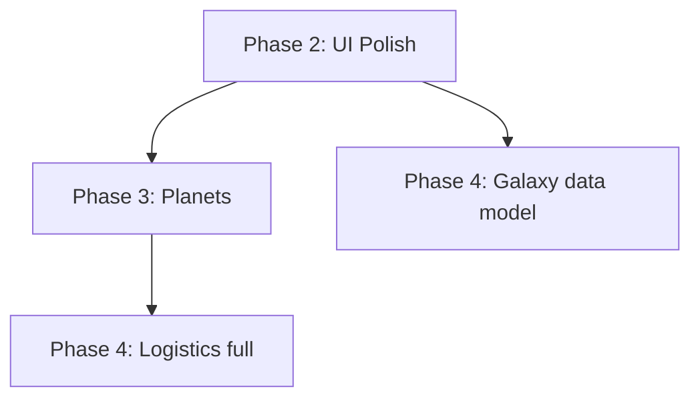

# Agent Roster: Infinite Flux Vibe

## Philosophy

Each agent is a specialist that owns a crate or domain. Agents work in **parallel worktrees** so they don't conflict. The orchestrator (you + Claude Code) assigns tasks and merges results.

The key insight: our **crate-per-domain architecture** maps perfectly to **one agent per crate**. Agents can work independently because crate boundaries enforce clean APIs.

---

## Agent Definitions

### 1. Simulation Agent
**Owns:** `if_common`, `if_world`, `if_factory`
**Skills:** Rust, Bevy ECS, game simulation, data modeling
**Responsibilities:**
- Core types (items, recipes, skills, components)
- Grid system, resource nodes, world generation
- Factory mechanics (mining, transport, production, power)
- Simulation tick systems (FixedUpdate)
- Unit tests for all simulation logic

**When to use:** Any task touching game data, ECS components, or simulation systems.

### 2. UI Agent
**Owns:** `if_client` (rendering, UI, input)
**Skills:** Bevy rendering, bevy_egui, UX design, input handling
**Responsibilities:**
- Camera systems, grid rendering
- Building placement, ghost preview
- HUD, building labels, notifications
- egui panels (building palette, stats dashboard, market UI)
- Sound effects, visual feedback
- Tutorial sequence

**When to use:** Any visual, interactive, or UX task.

### 3. Networking Agent
**Owns:** `if_protocol`, `if_server`
**Skills:** Rust async, Tokio, Quinn/Renet, PostgreSQL/SQLx, client-server architecture
**Responsibilities:**
- Message protocol definitions (Serde + Bincode)
- Server-authoritative simulation loop
- Client-side prediction and reconciliation
- Area-of-interest filtering
- Database persistence
- Authentication
- Load testing

**When to use:** Phase 5+ networking tasks. This agent touches the most complex Rust (async, concurrency, Send+Sync).

### 4. Economy Agent
**Owns:** `if_economy`
**Skills:** Financial systems, order matching, fixed-point arithmetic, database transactions
**Responsibilities:**
- Order book matching engine
- Market data (price history, charting)
- Credits system (fixed-point, no floats)
- Contracts (courier, manufacturing, mercenary)
- Corporation finance (wallets, shares, dividends)
- Banking (loans, interest, default mechanics)

**When to use:** Phase 6+ economy tasks. Must coordinate with Simulation Agent on item types and with Networking Agent on transaction atomicity.

### 5. Combat Agent
**Owns:** `if_combat`
**Skills:** Game physics, spatial data structures, damage models, AI
**Responsibilities:**
- Ship fitting system (modules, hardpoints, power/CPU)
- Damage model (types, resistances, falloff, tracking)
- Targeting, electronic warfare
- Fleet mechanics (grouping, FC commands)
- Heat, capacitor, ammunition systems
- NPC AI (Silica Swarm)
- Ship destruction and loot

**When to use:** Phase 7+ combat tasks.

### 6. Governance Agent
**Owns:** `if_politics`
**Skills:** State machines, permission systems, complex business logic
**Responsibilities:**
- Corporation system (roles, permissions, hierarchy)
- Alliance system (standings, diplomacy)
- Sovereignty and territorial control
- Customs offices, tariffs
- Stock market, hostile takeovers
- Elections, voting, policy levers
- Espionage mechanics, audit logs

**When to use:** Phase 8+ politics tasks.

### 7. Tech Agent
**Owns:** `if_tech`
**Skills:** Graph data structures, progression systems, game balance
**Responsibilities:**
- Tech tree data model and UI
- Research hubs (consume items → unlock tech)
- Infinite marginal upgrades
- Unlock effects (new recipes, machines, modules)
- Megastructure framework

**When to use:** Phase 10 research tasks.

### 8. QA Agent
**Owns:** Nothing — reviews everything
**Skills:** Testing, profiling, security auditing
**Responsibilities:**
- Run `cargo clippy`, `cargo test`, `cargo fmt` across workspace
- Integration tests (cross-crate interactions)
- Performance profiling (`cargo flamegraph`)
- Security audit (no `.unwrap()` in production paths, no float currency)
- CVE checks on dependencies

**When to use:** After every merge. Can run in background continuously.

---

## Parallelization Strategy

### Within a Phase
Most tasks within a phase can be parallelized:

### Across Phases
Later phases can start early on their data models while earlier phases finish UI:

### Conflict Resolution
- Agents work in **isolated worktrees** (git branches)
- Merges go through the QA Agent
- If two agents modify `if_common`, the orchestrator resolves conflicts
- Crate APIs are the contract — internals can change freely

---

## Agent-Task Mapping by Phase

| Phase | Primary Agent | Support Agents |
|:------|:-------------|:---------------|
| 1 (Factory) | Simulation | UI |
| 2 (UI) | UI | Simulation (save/load) |
| 3 (Planets) | Simulation | UI (orbital view) |
| 4 (Logistics) | Simulation | UI (logistics manager) |
| 5 (Networking) | Networking | Simulation (server split) |
| 6 (Economy) | Economy | UI, Networking |
| 7 (Combat) | Combat | UI, Simulation (ships) |
| 8 (Politics) | Governance | UI, Economy |
| 9 (Zones) | Simulation | Combat (siege) |
| 10 (Research) | Tech | UI, Simulation |
| 11 (Polish) | QA | All |