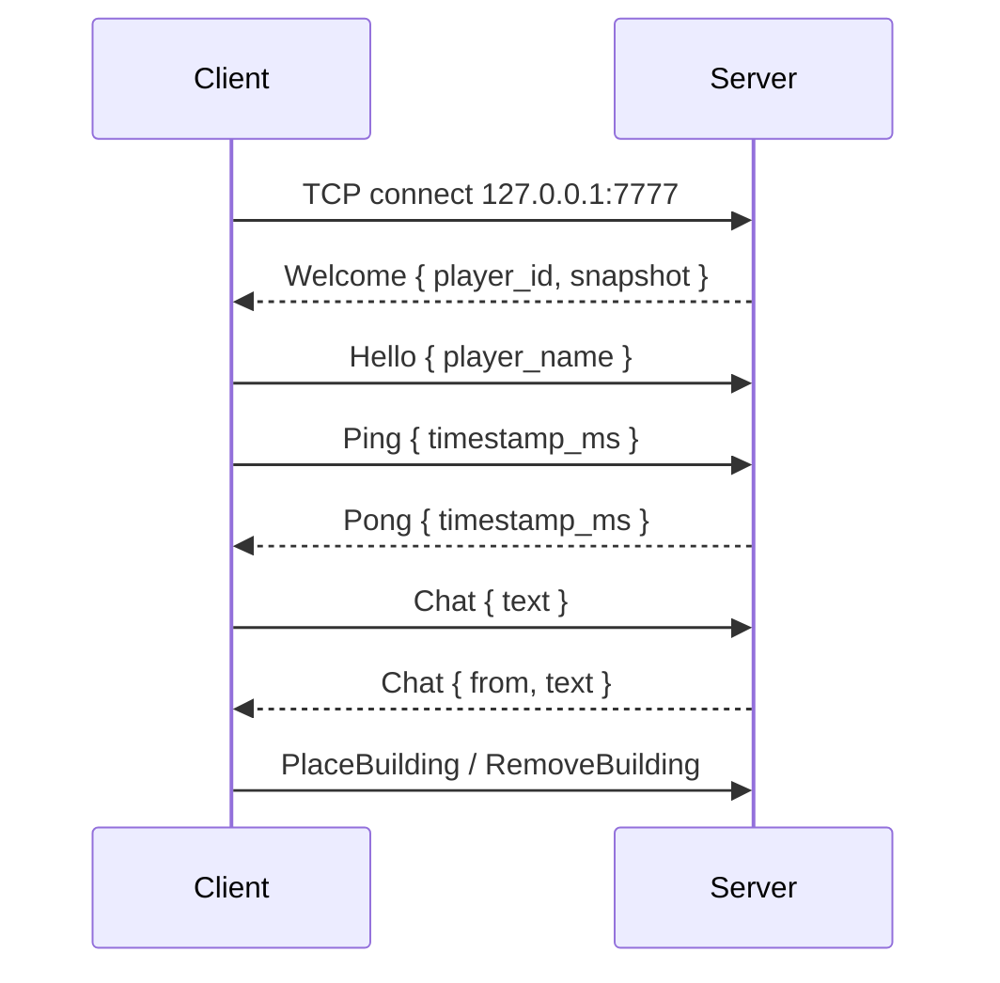

# Networking (Phase 5 Foundation)

This document describes the current client-server networking foundation.
It is deliberately minimal; it exists so future work has something concrete to
iterate against.

## Crates

| Crate         | Purpose                                                      |
|---------------|--------------------------------------------------------------|
| `if_protocol` | Wire types + length-prefixed framing shared by both sides.   |
| `if_server`   | Headless authoritative server binary.                        |
| `if_client`   | Adds optional networking (F9 to connect, T to chat).         |

## Running the server

```bash
cargo run -p if_server
```

The server binds `127.0.0.1:7777`, logs startup info, and ticks a headless
Bevy app at 60 Hz with `WorldPlugin` + `FactoryPlugin` loaded. Networking runs
on a dedicated OS thread with a `tokio::runtime::current_thread` runtime.

## Running the client

```bash
cargo run -p if_client
```

Single-player works exactly as before. To use multiplayer features:

- Press **F9** to toggle a connection to `127.0.0.1:7777`.
- Press **T** to open the chat panel. Enter sends, Esc closes.

There's an always-visible status strip in the bottom-left showing whether
you're online.

## Protocol

All messages are bincode-encoded and wrapped in a big-endian `u32` length
prefix. Max frame size is 16 MiB (see `if_protocol::MAX_FRAME_SIZE`).



See `crates/if_protocol/src/lib.rs` for the authoritative message definitions.

## Server architecture

```mermaid
flowchart LR
    bevy[Bevy scheduler<br/>(main thread)]
    drain[drain_network_inbound]
    net[Network thread<br/>(tokio current-thread runtime)]
    tcp[TCP listener<br/>:7777]

    bevy --> drain
    drain -- std::mpsc::Receiver --> net
    drain -- std::mpsc::Sender --> net
    net --> tcp
    tcp --> net
```

- `spawn_network_thread` creates two `std::sync::mpsc` channels and returns a
  `NetHandle` resource. Bevy uses `try_recv` on the inbound channel — it never
  blocks the scheduler.
- Each accepted connection spawns a reader task (socket → frames → inbound
  channel) and a writer task (per-client outbound channel → socket).
- Broadcasts are dispatched by looping over the shared client map.

## Current limitations

- **No authentication.** Anyone who can reach the port can connect as anyone.
- **No encryption.** Plaintext TCP on loopback only for now.
- **No reliability layer above TCP.** TCP handles ordering + reliability per
  stream, but we have no recovery for half-open connections or mid-frame
  drops beyond closing the socket.
- **Single shard.** The server does not yet care about which star system a
  player is in or apply area-of-interest filtering.
- **Server does not apply actions to the simulation.** `PlaceBuilding` /
  `RemoveBuilding` are logged but not yet executed against the authoritative
  world. The foundation focuses on the transport layer.
- **No persistence.** Nothing saves to disk or a database.
- **No client-side state reconciliation.** `StateUpdate` frames are received
  and logged but not applied to the local ECS yet.

## Next steps

1. Apply client actions against the server's simulation and broadcast
   `StateUpdate` deltas.
2. Apply `StateUpdate` in the client so other players' buildings appear.
3. Area-of-interest filtering (per-body visibility).
4. Swap TCP for QUIC via `quinn` or a higher-level crate (`renet`) once the
   game actually needs unreliable channels and NAT traversal.
5. Authentication + handshake versioning (use `if_protocol::PROTOCOL_VERSION`).
6. PostgreSQL persistence for player state.
7. Load testing: simulate N idle clients, measure bandwidth, latency, CPU.

## Testing

Protocol round-trips and framing:

```bash
cargo test -p if_protocol
```

Server integration (spawns the network thread, drives a ping/pong):

```bash
cargo test -p if_server
```

Full workspace:

```bash
cargo clippy --workspace -- -D warnings
cargo test --workspace
```
