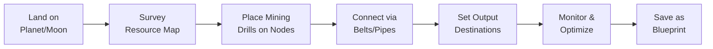
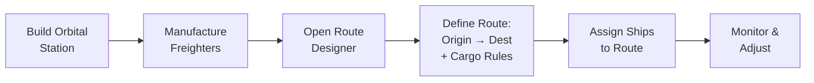
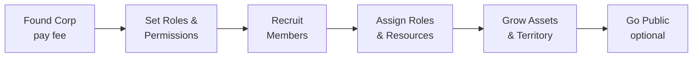
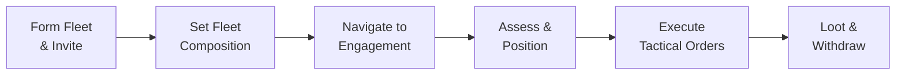
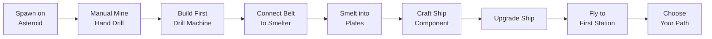

# Core Gameplay Workflows: Infinite Flux

This document describes the primary player workflows — the step-by-step sequences players follow to accomplish goals. Each workflow maps user intent through system interactions to outcomes.

---

## 1. Factory Construction Workflow

**Goal:** Build a functioning production chain on a planetary surface.

### Steps:
1. **Approach & Land:** From orbital view, select planet → "Land" → choose landing zone near resource deposits.
2. **Survey:** Open resource overlay to see node types, yields, and depletion rates.
3. **Plan Layout:** Optionally load a Blueprint or free-place. Ghost preview shows validity.
4. **Place Extractors:** Position mining drills / pump jacks on resource nodes.
5. **Place Processing:** Build smelters, refineries, assemblers downstream.
6. **Route Materials:** Lay conveyor belts and pipes connecting extractor → processor → output.
7. **Power:** Build power generators (solar, fuel-burning, geothermal) and connect via power lines.
8. **Activate & Monitor:** Turn on the chain. Watch throughput meters. Identify bottlenecks.
9. **Iterate:** Add parallel lines, upgrade machines, re-route belts to improve throughput.
10. **Save Blueprint:** Select working layout → save as Blueprint for reuse or sale.

### System Interactions:
- **Grid System:** Validates placement, handles collisions.
- **Resource System:** Ticks extraction rates, tracks node depletion.
- **Logistics System:** Moves items along belts, balances splitters/mergers.
- **Power System:** Calculates grid load vs. generation capacity.

---

## 2. Interplanetary Logistics Workflow

**Goal:** Establish automated freight routes between planetary bases and orbital stations.

### Steps:
1. **Prerequisites:** At least two locations with storage (planetary base + orbital station, or two stations).
2. **Open Logistics Manager:** From any view, hotkey or menu.
3. **Create New Route:** Click "New Route" → select origin → select destination.
4. **Configure Cargo:** Set item filters (what to carry), fill thresholds (depart when X% full or every N minutes).
5. **Set Schedule:** Continuous loop, on-demand (triggered by threshold), or timed intervals.
6. **Fuel Planning:** System shows fuel cost per trip. Player ensures fuel is available at origin station.
7. **Assign Ships:** Drag available freighters onto the route. System shows capacity utilization.
8. **Activate:** Route goes live. Ships begin autonomous operation.
9. **Monitor:** Dashboard shows transit status, delivery logs, delays, attacks.
10. **Optimize:** Adjust routes for fuel efficiency, add waypoints to avoid hostile space, rebalance cargo priorities.

### System Interactions:
- **Navigation System:** Pathfinding across star systems, warp gate routing.
- **Cargo System:** Tracks physical items in ship holds.
- **Fuel System:** Consumes fuel per distance/mass, models warp-spooling.
- **Threat System:** AI or player interdiction along routes.

---

## 3. Market Trading Workflow

**Goal:** Buy and sell goods on the player-driven commodity exchange.

### Steps:
1. **Dock at Station:** Must be physically docked to access that station's market.
2. **Open Market Panel:** Browse commodities or search by name/category.
3. **Analyze:** Review order book (bids/asks), price history chart, trade volume.
4. **Place Order:**
   - **Instant Buy/Sell:** Match existing orders at current best price.
   - **Limit Order:** Set your price. Order sits in book until matched or cancelled.
5. **Settlement:** Items transfer between hangars. Credits transfer between wallets. Physical — items occupy cargo space.
6. **Haul (if needed):** If buying at a remote station, arrange transport (personal ship, courier contract, freight route).

### Sub-Workflow: Posting a Courier Contract
1. Open Contract Board → "Create Courier Contract."
2. Set pickup station, delivery station, package contents, collateral, reward.
3. A freight player accepts → picks up package → delivers → gets paid.
4. If they fail/steal: collateral is paid to the poster.

---

## 4. Corporation Management Workflow

**Goal:** Create and manage a player corporation.

### Steps:
1. **Found:** Pay credit fee → name corporation → set tax rate on member earnings.
2. **Configure Roles:** Define roles (Director, Logistics Officer, Factory Manager, etc.) with granular permissions.
3. **Recruit:** Invite players or post recruitment ads. Applicants reviewed by directors.
4. **Assign Roles:** Place members into roles. Grant hangar/wallet access as needed.
5. **Shared Assets:** Corporation wallet, shared hangars, shared blueprint library.
6. **Grow:** Build corp-owned factories, stations, fleets.
7. **Go Public (optional):** Issue shares on Stock Market. Raise capital. Risk hostile takeover.

### Sub-Workflow: Hostile Takeover Defense
1. Alert: significant share purchases detected.
2. Board (CEO + Directors) decides: buy back shares, issue new shares (dilution), seek allied buyout, or prepare for transition.
3. If controlling interest acquired: attacker gains CEO role. All assets transfer.

---

## 5. Combat & Fleet Command Workflow

**Goal:** Engage in tactical fleet combat.

### Steps:
1. **Fit Ships:** At station, equip modules (weapons, defenses, propulsion, electronic warfare).
2. **Load Munitions:** Physical ammo loaded from station hangar into cargo hold.
3. **Form Fleet:** Create fleet → invite players → assign fleet roles (FC, scouts, logistics).
4. **Undock & Travel:** Fleet warps together. FC calls navigation.
5. **Engage:**
   - FC calls primary target.
   - Players lock target → set orbit distance → activate weapons.
   - Logistics ships manage remote repairs.
   - Electronic warfare ships jam/disrupt enemies.
6. **Manage Resources:** Monitor capacitor, heat, ammo. Reload from cargo. Manage heat dissipation.
7. **Tactical Decisions:** FC calls target switches, retreats, reinforcement positioning.
8. **Disengage or Destroy:** Fight until one side retreats or is destroyed.
9. **Loot:** Salvage wrecks for components and materials.

### System Interactions:
- **Targeting System:** Lock time based on ship sensors vs. target signature.
- **Damage Model:** Projectile tracking, damage types vs. resistance profiles.
- **Heat System:** Overheating modules for bonus performance at risk of burnout.
- **Capacitor System:** Energy pool that powers active modules.

---

## 6. Siege Warfare Workflow

**Goal:** Attack or defend a fortified system/base.

### Attacker Workflow:
1. **Intelligence:** Scout target system. Map defenses, fleet strength, supply routes.
2. **Staging:** Assemble fleet and supplies at a nearby system. Manufacture siege equipment.
3. **Blockade:** Deploy fleet at warp gates to interdict supply lines.
4. **Orbital Bombardment:** Position dreadnoughts to engage orbital platforms.
5. **FOB Construction:** Land on planet. Build Forward Operating Base factory for local ammo/repair production.
6. **Ground Assault:** Push toward defender's factory network. Overwhelm power grid with sustained DPS.
7. **Capture:** When shields fall (defender runs out of fuel/coolant), seize or destroy infrastructure.

### Defender Workflow:
1. **Detection:** Scouts or customs office logs detect hostile buildup.
2. **Alert Alliance:** Broadcast to allied corporations. Request reinforcements.
3. **Reroute Supply:** Redirect logistics to stockpile fuel, ammo, repair materials.
4. **Power Management:** Shut down non-essential factories. Maximize defensive output.
5. **Engage:** Deploy fleet, activate planetary artillery, launch interceptor drones.
6. **Counter-Blockade:** Allied fleets attempt to break the warp gate blockade.
7. **Attrition:** Outlast attacker's supply chain. Force them to withdraw.

---

## 7. Research & Progression Workflow

**Goal:** Unlock new technologies for the corporation.

### Steps:
1. **Build Research Hub:** Construct a research facility at a station or planet.
2. **Select Technology:** Open tech tree → choose target research node.
3. **Supply Materials:** Research consumes manufactured items. Set up dedicated production lines feeding the research hub.
4. **Queue Management:** Prioritize research order. Some techs have prerequisites.
5. **Wait & Feed:** Research progresses as materials are consumed. Faster feed = faster completion.
6. **Unlock:** Technology becomes available for all corp members.
7. **Infinite Upgrades:** After core tree, invest in marginal upgrades with exponential costs.

---

## 8. Espionage Workflow

**Goal:** Infiltrate an enemy corporation to steal intelligence or sabotage.

### Steps:
1. **Create Alt / Recruit Agent:** Establish a character with no obvious ties to your corporation.
2. **Apply to Target Corp:** Build trust through legitimate activity. Get accepted.
3. **Gain Access:** Rise through ranks. Get assigned roles with increasing permissions.
4. **Execute Mission:**
   - **Intel:** Leak fleet movements, factory locations, defense schedules.
   - **Theft:** Copy proprietary blueprints from corp library.
   - **Sabotage:** Alter logic circuits in automated defense grid. Set to deactivate at a specific time.
5. **Extract:** Leave corp or maintain cover for future operations.

### System Interactions:
- **Permission System:** Espionage is constrained by in-game role permissions, not exploits.
- **Audit Logs:** Corps can review access logs if they invest in security infrastructure.
- **Counter-Intelligence:** Corps can hire players to investigate suspicious activity.

---

## 9. Governance & Politics Workflow

**Goal:** Participate in system governance and territorial control.

### Steps:
1. **Claim System:** Alliance deploys sovereignty structure in unclaimed system.
2. **Set Up Infrastructure:** Build customs offices on warp gates, deploy environmental shields.
3. **Configure Taxes:** Set tariff rates for passing traffic. Set local market fees.
4. **Call Election (safe systems):** Schedule parliamentary election. Candidates register.
5. **Campaign & Vote:** Players lobby, form coalitions, cast votes.
6. **Govern:** Elected council adjusts policies (tax rates, defense spending, trade agreements).
7. **Defend Sovereignty:** Repel challenges to territorial control through diplomacy or warfare.

---

## 10. New Player Onboarding Workflow

**Goal:** Teach a new player the core mechanics without overwhelming them.

Mining is the universal starting point — it teaches the foundational mechanics that apply across all activities. After the tutorial, the game deliberately exposes players to the breadth of what's possible, and they naturally gravitate toward whatever interests them.

### Steps:
1. **Spawn:** Player appears on asteroid in Precursor Cradle (safe zone). Brief cinematic.
2. **Hand-Drill Tutorial:** Prompted to click a copper node. Learn basic interaction.
3. **First Machine:** Build a mining drill. Learn grid placement.
4. **First Belt:** Connect drill to smelter. Learn belt routing.
5. **First Product:** Produce copper plates. Understand production chains.
6. **First Component:** Craft a hull plate. Understand that everything is player-made.
7. **Ship Upgrade:** Install component on shuttle. Learn ship fitting basics.
8. **First Flight:** Fly to adjacent system. Learn navigation.
9. **First Dock:** Dock at a station. Discover the market board, contract board, bounty board, and recruitment ads.
10. **Freedom:** Tutorial complete. The player is free to pursue any combination of activities — manufacture goods, trade on the market, accept courier contracts, join a corporation, hunt bounties, or continue optimizing their mining operation.

### Progressive Unlocks:

UI panels unlock as the player encounters relevant activities — this keeps the interface clean and lets each player's UI reflect their interests.

| Milestone | Unlocked UI | Activities It Enables |
|:---|:---|:---|
| First station dock | Market Panel, Contract Board | Trading, hauling, courier work |
| First ship encounter | Fleet Panel | Combat, bounty hunting, mercenary work |
| Join corporation | Corp Management Panel | Corporate industry, shared assets, roles |
| Accept courier contract | Logistics Manager | Freight hauling, route optimization |
| Enter Fracture Sector | Threat Overlay | PvE combat, fortified mining |
| First research | Tech Tree Panel | Research, science, tech progression |
| Join/create alliance | Governance Panel | Politics, diplomacy, territorial control |
| First share purchase | Stock Market Panel | Finance, investment, hostile takeovers |
